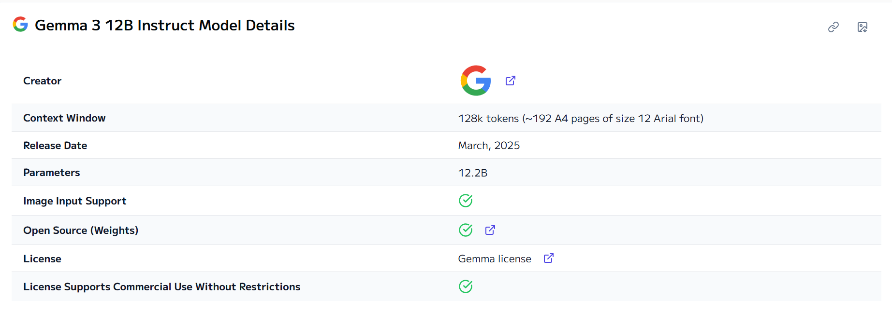
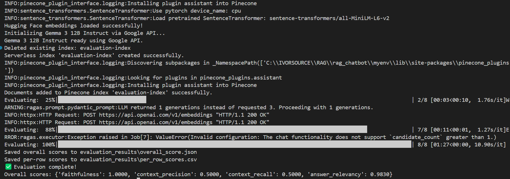
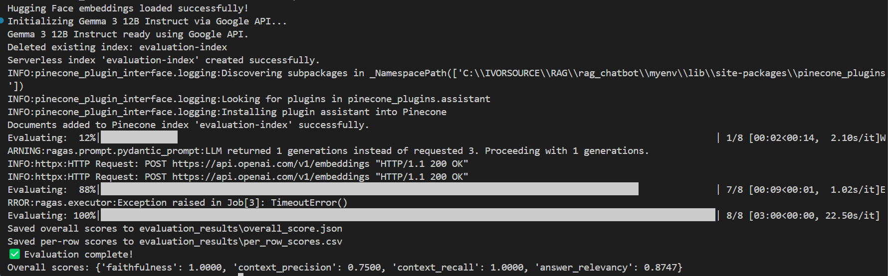
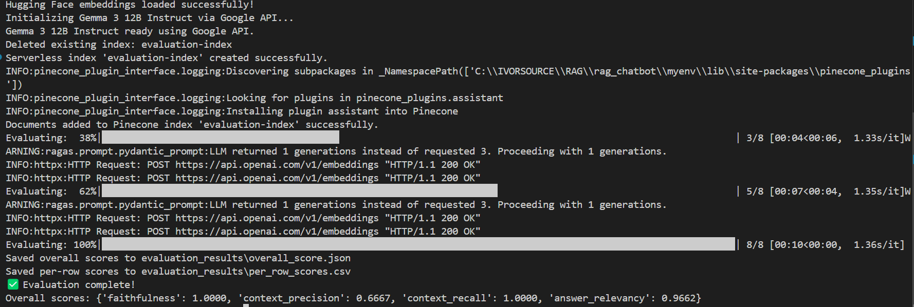
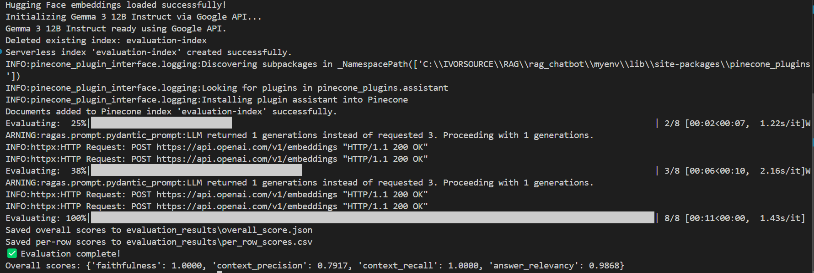

# Retrieval-Augmented Generation (RAG)

## Overview
**Retrieval-Augmented Generation (RAG)** is a framework that enhances **Large Language Models (LLMs)** by enabling them to **retrieve and incorporate external information** before generating a response.  
Unlike traditional LLMs that rely solely on static training data, RAG dynamically pulls relevant text from external knowledge sources such as:
- Databases
- Uploaded documents
- Web pages or APIs

This allows models to use **up-to-date** and **domain-specific information** not available during initial training.

---

## Why RAG is Important
- **Reduces hallucinations:** By grounding responses in factual retrieved content, RAG minimizes fabricated or inaccurate statements.
- **No need for retraining:** Instead of retraining models with new data, RAG updates the external knowledge base, saving time and computational cost.
- **Transparency and traceability:** RAG systems can cite sources, allowing users to verify and trust the output.
- **Domain adaptation:** Enables LLMs to understand specialized fields such as finance, healthcare, and legal domains.

---

## RAG Architecture and Process

### 1. Data Preparation
Relevant documents (structured, semi-structured, or unstructured) are:
- **Converted into embeddings** — numerical vector representations of text.
- **Stored in a vector database** for similarity-based retrieval.

### 2. Retrieval Stage
When a user submits a query:
1. The query is converted into an embedding.
2. The system searches the **vector database** using similarity metrics (e.g., cosine similarity).
3. The **most relevant documents** are retrieved to provide factual grounding.

### 3. Augmentation Stage
The retrieved context is **injected into the prompt** (a process sometimes called *prompt stuffing*) along with the user’s question.

### 4. Generation Stage
The **LLM** receives both the query and retrieved content, then generates a response that is:
- Contextually accurate  
- Supported by the external sources  
- Tailored to the query  

### 5. Optional Refinements
- **Re-ranking:** Improves retrieval accuracy by prioritizing the most relevant chunks.  
- **Context selection:** Filters and organizes context for optimal prompt length and relevance.  
- **Memory modules:** Learn from previous retrievals for improved performance over time.

---

## Key Technical Concepts

### 🔹 Embeddings
- Represent text as **dense or sparse vectors**.
- Dense vectors capture meaning; sparse vectors capture exact words.
- Hybrid approaches combine both for improved precision and efficiency.

### 🔹 Similarity Search
- Uses mathematical measures like **cosine similarity** or **dot product**.
- Can leverage **Approximate Nearest Neighbor (ANN)** algorithms for faster lookups at scale.

### 🔹 Retriever Optimization
- **Inverse Cloze Task (ICT):** Teaches retrievers to predict missing sentences for better recall.
- **Supervised retriever fine-tuning:** Aligns retriever results with generator preferences.
- **Reranking:** Improves quality by scoring retrieved results for contextual accuracy.

### 🔹 Chunking
Breaks large documents into manageable, semantically meaningful sections.  
Common methods:
- **Fixed length with overlap**
- **Syntax-based chunking** (using NLP libraries like spaCy or NLTK)
- **Format-aware chunking** (e.g., code functions, HTML sections, or PDF paragraphs)

### 🔹 Hybrid Search
Combines:
- **Vector similarity search** (semantic understanding)
- **Keyword or text search** (exact matches)

This ensures more comprehensive retrieval, especially for factual or specific queries.

---

## Evaluation and Benchmarks
RAG systems are evaluated on:
- **Retrievability** – how well relevant documents are found  
- **Retrieval accuracy** – precision and recall of relevant chunks  
- **Generative quality** – coherence, factuality, and fluency of the final output  

Common benchmarks:
- **BEIR** (for diverse retrieval tasks)
- **Natural Questions (NQ)**
- **Google QA**

---

## Challenges and Limitations
While RAG improves factual accuracy and adaptability, it does not completely eliminate errors:
- **Residual hallucinations:** LLMs can still misinterpret factual context.
- **Context misinterpretation:** Retrieved data may be misunderstood or taken out of context.
- **Conflicting sources:** Difficulty in resolving contradictions across documents.
- **Overreliance on retrieval:** If the retriever fetches poor-quality or irrelevant data, generation quality drops.

---

## Summary
| Stage | Purpose | Key Benefit |
|--------|----------|--------------|
| Data Preparation | Convert and store documents as embeddings | Enables semantic search |
| Retrieval | Identify most relevant context | Improves factual grounding |
| Augmentation | Inject retrieved data into prompt | Enhances contextual accuracy |
| Generation | Produce final output using LLM | Context-aware response |
| Evaluation | Measure retrievability and accuracy | Ensures performance quality |

---

**In short:**  
> RAG bridges the gap between static-trained LLMs and the ever-evolving world of information.  
It brings real-world knowledge into generation time, improving accuracy, adaptability, and trustworthiness in AI systems.

# Retriever Evaluation Metrics

In RAG systems, evaluating retriever quality ensures that the most relevant documents support accurate responses from the language model. Retriever metrics like Context Precision, Context Recall, Noise Sensitivity, and Context Entity Recall help quantify how well retrieved information aligns with the user's query and provides necessary grounding for the generator. Without high-quality retrieval, even the best language models produce misleading or irrelevant outputs.

# Context Precision and Context Recall

Context precision and recall are fundamental metrics for evaluating retrieval performance:

**Context precision** measures how many retrieved chunks are actually relevant. It's computed by averaging the precision@k across all chunks, where precision@k is the ratio of relevant chunks within the top-k retrieved results. K is the total number of chunks in retrieved context and Vk∈{0,1} is the relevance indicator at rank K.

**Context Recall** measures the proportion of relevant documents that were successfully retrieved, emphasizing completeness. Higher recall indicates fewer missed relevant pieces. Because it assesses what was not left out, calculating context recall always requires a reference set for comparison.

High precision means the system successfully returns mostly relevant results and minimizes false positives, while high recall means the system finds a substantial percentage of relevant documents, reducing false negatives or missed significant documents.

**ContextEntityRecall** measures how many entities from the reference are correctly retrieved in the context. It reflects the fraction of reference entities present in the retrieved content. This differs from traditional textual recall, which considers overlapping words or sentences, as ContextEntityRecall focuses specifically on named entities (people, places, dates, organizations).

**NoiseSensitivity** measures how often a system makes unsupported or incorrect claims based on retrieved documents, whether relevant or not. It ranges from 0 to 1, with lower scores indicating better reliability. The metric checks if each response claim aligns with the ground truth and is supported by the retrieved context.

# Generator Evaluation Metrics

Large Language Models (LLMs) are subject to hallucinations and may generate fictional facts that don't exist or aren't related to the provided context. It's crucial to evaluate the quality of what was generated. This is where generator evaluation metrics come into play—they help assess not only whether the response is factually accurate (faithfulness) but also how well it aligns with the user's original input or intent (response relevancy). These metrics are essential for ensuring that LLM output is both trustworthy and useful, especially in high-stakes or production-grade applications.

**Faithfulness** evaluates how factually accurate a response is in relation to the retrieved context. It's scored between 0 and 1, where a higher score means greater factual consistency. A response is considered faithful if every claim it makes can be supported by the provided context. To calculate this metric, first identify all claims in the response. Then, for each claim, verify whether it can be inferred from the retrieved context. The final faithfulness score is computed based on how many claims are supported.

**Response Relevancy** evaluates how well a system's response aligns with the user's input. A higher score means the response directly addresses the user's question, while a lower score suggests the response may be incomplete or contain unnecessary information. To calculate this metric, a few artificial questions (typically three) are generated based on the response to capture its content. Then, the cosine similarity is computed between the user input and each of these questions using their embeddings. The average of these similarity scores gives the final ResponseRelevancy score.

# What should we think about when choosing a chunking strategy?

Several variables play a role in determining the best chunking strategy, and these variables vary depending on the use case. Here are some key aspects to keep in mind:

**What kind of data is being chunked?** Are you working with long documents, such as articles or books, or shorter content, like tweets, product descriptions, or chat messages? Small documents may not need to be chunked at all, while larger ones may exhibit certain structure that will inform chunking strategy, such as sub-headers or chapters.

**Which embedding model are you using?** Different embedding models have differing capacities for information, especially on specialized domains like code, finance, medical, or legal information. And, the way these models are trained can strongly affect how they perform in practice. After choosing an appropriate model for your domain, be sure to adapt your chunking strategy to align with expected document types the model has been trained on.

**What are your expectations for the length and complexity of user queries?** Will they be short and specific or long and complex? This may inform the way you choose to chunk your content as well so that there’s a closer correlation between the embedded query and embedded chunks.

**How will the retrieved results be utilized within your specific application?** For example, will they be used for semantic search, question answering, retrieval augmented generation, or even an agentic workflow? For example, the amount of information a human may review from a search result may be smaller or larger than what an LLM may need to generate a response. These users determine how your data should be represented within the vector database.

# Which similarity search to use?

The basic rule of thumb in selecting the best similarity metric for your Pinecone index is to match it to the one used to train your embedding model. For example, the all-MiniLM-L6-v2 model was trained using cosine similarity — so using cosine similarity for the index will produce the most accurate result. If you used a Euclidean distance measure to train your model, the same similarity metric should be used in the index, etc. Pinecone will be able to use the best algorithms as long as we follow this rule.

# Which model to choose based on your usecase?

I have choose Gemma 3 - 12B  paramenter model. As my usecase is small and I want go for a non-reasoning model with low cost. 

Below are some of the important metrics we need to look into while selecting the LLM model based on our use case:

1. Artificial Analysis Intelligence Index; Higher is better
2. Output Tokens per Second; Higher is better
3. USD per 1M Tokens; Lower is better 

# For Groundtruth dataset with 2 samples and Retrieved chunks as well top 2. Chunk size= 300, overlap = 80

# Chunk size= 300, overlap = 80
## For Groundtruth dataset with 2 samples with Zero shot prompting technique. and Retrieved chunks as well top 3. 

## For Groundtruth dataset with 2 samples with One shot prompting technique. 

## For Groundtruth dataset with 2 samples with Chain of thought prompting technique. 

# Chunk size= 400, overlap = 80

## For Groundtruth dataset with 2 samples with Zero shot prompting technique. and Retrieved chunks as well top 3. 

## For Groundtruth dataset with 2 samples with One shot prompting technique. and Retrieved chunks as well top 3. 

## For Groundtruth dataset with 2 samples with Chain of thought prompting technique. and Retrieved chunks as well top 3. 

# Chunk size= 500, overlap = 80

## For Groundtruth dataset with 2 samples with Zero shot prompting technique. and Retrieved chunks as well top 3. 

## For Groundtruth dataset with 2 samples with One shot prompting technique. and Retrieved chunks as well top 3. 

## For Groundtruth dataset with 2 samples with Chain of thought prompting technique. and Retrieved chunks as well top 3. 

# Chunk size= 600, overlap = 80
## For Groundtruth dataset with 2 samples with Zero shot prompting technique. and Retrieved chunks as well top 3. 

## For Groundtruth dataset with 2 samples with One shot prompting technique. and Retrieved chunks as well top 3. 

## For Groundtruth dataset with 2 samples with Chain of thought prompting technique. and Retrieved chunks as well top 3. 

# Results explanation:

First, I began evaluating the RAG model using a ground truth dataset. I tested the same set of questions from this dataset on the model and compared the model’s predicted responses with the ground truth using RAG evaluation metrics such as context precision, context recall, answer relevancy, and faithfulness.

To determine the optimal chunk size, I started experimenting with a chunk size of 300, which yielded a context precision and context recall score of 0.5.

Next, I increased the chunk size to 400, achieving 0.75 context precision and 1.0 context recall.

When I further increased the chunk size to 500, the context precision improved to 0.79.

Finally, at a chunk size of 600, I achieved 1.0 context precision.

I also tested three different prompt types—zero-shot, one-shot, and chain-of-thought—and found that the chain-of-thought prompt with a chunk size of 600 produced the best results among all configurations.

# References:
1. https://artificialanalysis.ai/leaderboards/models
2. https://docs.ragas.io/en/latest/concepts/metrics/available_metrics/context_precision/
3. https://www.pinecone.io/learn/vector-similarity/
4. https://www.pinecone.io/learn/chunking-strategies/
5. https://agenta.ai/blog/how-to-evaluate-rag-metrics-evals-and-best-practices